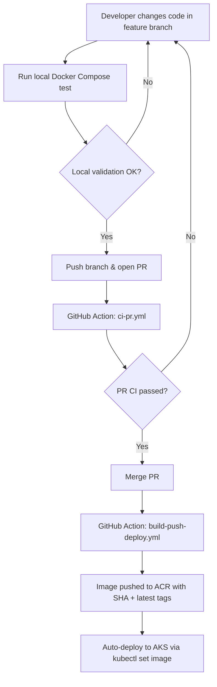

# Backstage — CI/CD & Deployment

Backstage application deployed on AKS with automated CI/CD using GitHub Actions and Azure Container Registry (ACR).

---

## Repository Layout

```
├── .github/workflows/
│   ├── ci-pr.yml                  # PR validation (build only, no push)
│   └── build-push-deploy.yml      # Build, push to ACR, deploy to AKS
├── backstage/                     # Backstage app source
│   ├── packages/app/              # Frontend
│   ├── packages/backend/          # Backend + Dockerfile
│   ├── app-config.yaml            # Development config
│   ├── app-config.production.yaml # Production config
│   └── docker-compose.yml         # Local dev stack
├── k8s/                           # Kubernetes manifests
│   ├── namespace.yaml
│   ├── postgres-*.yaml            # PostgreSQL (secret, storage, deployment, service)
│   └── backstage-*.yaml           # Backstage (secret, deployment, service)
├── docs/
│   └── AZURE-ENTRA-SSO-GUIDE.md   # Microsoft Entra ID SSO setup guide
└── README.md
```

---

## High-Level Flow



---

## Prerequisites

- Docker (for local builds and running the dev stack)
- `kubectl` configured for the target AKS cluster
- GitHub access to this repository
- GitHub Secrets configured (see below)

---

## Step 1 — Local Validation (Docker Compose)

Build and test locally before opening a PR.

```bash
cd backstage

# Build
yarn tsc
yarn build:backend
docker buildx build . -f packages/backend/Dockerfile --tag backstage-local:latest --load

# Run
GITHUB_TOKEN=<your-token> docker compose up -d

# Validate at http://localhost:7007

# Stop
docker compose down
```

---

## Step 2 — Open PR (CI Validation)

Push your branch and open a PR to `main`. `ci-pr.yml` triggers automatically on the self-hosted runner.

**What it does:**
- Builds the backend bundle in a `node:24-slim` container
- Builds a Docker image (smoke test, no push)
- Reports pass/fail on the PR

**Does not** push images or deploy anything.

---

## Step 3 — Merge PR

Once CI is green, merge the PR. The merge triggers `build-push-deploy.yml` automatically.

---

## Step 4 — Build, Push & Deploy (Automatic)

`build-push-deploy.yml` runs on every push to `main`.

**What it does:**
1. Builds backend bundle in `node:24-slim` container
2. Logs in to ACR
3. Builds Docker image (`--platform linux/amd64`)
4. Tags with `${GITHUB_SHA}` and `latest`
5. Pushes both tags to ACR
6. Runs `kubectl set image` to deploy to AKS
7. Waits for rollout to complete

---

## GitHub Secrets Required

| Secret | Description |
|---|---|
| `ACR_LOGIN_SERVER` | ACR URL (e.g. `myacr.azurecr.io`) |
| `ACR_USERNAME` | ACR username |
| `ACR_PASSWORD` | ACR password or token |

> **Note:** The self-hosted runner already has `kubectl` access to AKS, so no kubeconfig secret is needed.

---

## First-Time AKS Setup

Apply K8s manifests before the first pipeline deploy:

```bash
kubectl apply -f k8s/namespace.yaml
kubectl apply -f k8s/postgres-secret.yaml
kubectl apply -f k8s/postgres-storage.yaml
kubectl apply -f k8s/postgres-deployment.yaml
kubectl apply -f k8s/postgres-service.yaml
kubectl apply -f k8s/backstage-secret.yaml
kubectl apply -f k8s/backstage-service.yaml
kubectl apply -f k8s/backstage-deployment.yaml
```

After the Service is created, get the LoadBalancer IP:

```bash
kubectl get svc backstage -n backstage
```

Update `backstage/app-config.production.yaml` with the assigned URL in `app.baseUrl` and `backend.baseUrl`.

---

## Installed Plugins

**Backend:** app, proxy, scaffolder, scaffolder-github, techdocs, auth (guest + microsoft), catalog, permission, search, search-pg, kubernetes, notifications, signals

**Frontend:** catalog, apiDocs, catalogGraph, catalogImport, kubernetes, org, scaffolder, search, techdocs, userSettings, signInPage (guest + Microsoft)

---

## Additional Guides

- [Azure Entra SSO Setup](docs/AZURE-ENTRA-SSO-GUIDE.md)

---

## Quick Command Reference

```bash
# Local dev stack
cd backstage
GITHUB_TOKEN=<token> docker compose up -d
docker compose logs -f backstage
docker compose down

# Build checks
yarn tsc
yarn build:backend

# Build Docker image locally
docker buildx build . -f packages/backend/Dockerfile --tag backstage-local:latest --load

# AKS checks
kubectl get pods -n backstage
kubectl logs -n backstage -l app=backstage --tail=50
kubectl get svc backstage -n backstage
```

---

## Troubleshooting

- **PR CI fails:** Fix the build error locally, push again, CI re-runs automatically.
- **Deploy fails:** Check `KUBECONFIG_DATA` secret is valid and the AKS cluster is reachable from the runner.
- **Old UI after deploy:** Verify the pod is running the new image: `kubectl get pods -n backstage -o jsonpath='{.items[0].spec.containers[0].image}'`
- **GITHUB_TOKEN error on local compose:** The `integrations.github` config requires a non-empty token.
- **LoadBalancer IP changed:** Update `app.baseUrl` and `backend.baseUrl` in `app-config.production.yaml`.
