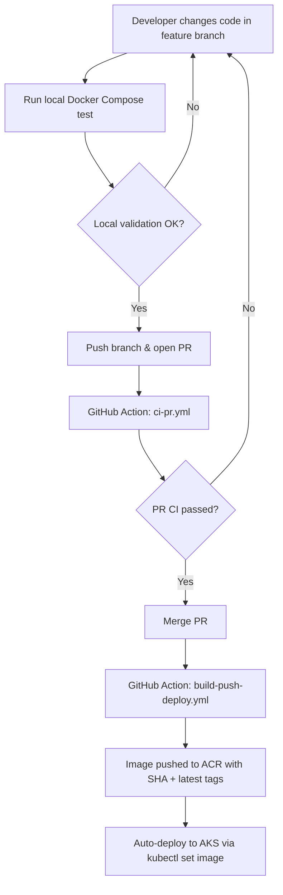

# Backstage CI/CD + Nexus Integration — Demo Script

---

## Section 1 — CI/CD Flow Overview (~2 min)

> **[SHOW: README.md — mermaid diagram]**

Alright, let me start by walking you through the CI/CD flow we designed for Backstage. This is the high-level picture — I'll go deeper into each part as we go.



So the flow is straightforward — a developer makes changes in a feature branch, tests locally using Docker Compose, and once they're happy, they push and open a PR. That triggers our first workflow, `ci-pr.yml`, which is a validation-only pipeline — it builds the entire Backstage backend to make sure nothing is broken, but it doesn't push any images or deploy anything. Think of it as a gate.

Once the PR is green and gets merged to `main`, the second workflow kicks in — `build-push-deploy.yml`. This is the real one. It builds the backend bundle, builds the Docker image, pushes it to ACR with the commit SHA and a `latest` tag, and then deploys it to AKS using `kubectl set image`. Fully automated, no manual steps after the merge.

The repo is structured like this — `.github/workflows` has the two pipelines, `backstage/` is the actual app source with the Dockerfile inside `packages/backend/`, `k8s/` has all the Kubernetes manifests, and `docs/` has setup guides for things like SSO and PostgreSQL.

---

## Section 2 — Improving Prototype (~3 min)

> **[SHOW: GitHub Actions runs from Improving environment, the Backstage URL]**

So we built and tested this entire pipeline first on Improving's own infrastructure, before touching anything on the client side. The idea was to get a working end-to-end setup that we could then adapt.

At this point we were using a regular GitHub-hosted runner — not self-hosted. We created an Azure Container Registry to store our Docker images, and an AKS cluster to deploy to. The AKS cluster had an internet-facing LoadBalancer, so the Backstage instance was accessible from a browser.

Here's what the pipeline does — it spins up a `node:24-slim` container, mounts the source code into it, and runs `yarn install`, `yarn tsc`, and `yarn build:backend` to produce the backend bundle. Then it takes that bundle and builds a Docker image using the Dockerfile in `packages/backend/`. The image gets tagged with the commit SHA and `latest`, pushed to ACR, and then we run `kubectl set image` to update the deployment on AKS.

On the Kubernetes side, we have a namespace called `backstage`, a PostgreSQL instance running in-cluster with a PersistentVolumeClaim for data, and the Backstage deployment itself behind a LoadBalancer service that maps port 80 to Backstage's port 7007.

Once it was all running, I shared the URL with Shashank and he confirmed it was working. So at this point we had a fully functional CI/CD pipeline with Backstage deployed and accessible.

We did hit a few issues during this phase that are worth mentioning — we had to fix the `baseUrl` configuration so Backstage knew its external URL, we needed to add `--platform linux/amd64` to the Docker build because the AKS nodes are AMD64, we had to deal with a CSP `upgrade-insecure-requests` issue since we were on HTTP, and we had to enable guest auth with `dangerouslyAllowOutsideDevelopment` for non-localhost access. All resolved.

---

## Section 3 — Client Environment Migration (~3 min)

> **[SHOW: Client org repo, workflow file, GitHub Actions run with OIDC login]**

So now that we had a proven pipeline, the next step was to take this same repo and push it to the client's GitHub org — `medica-dev-platform` — and get it running in their environment.

This is where things change significantly. Let me walk you through the key differences between our Improving setup and the client environment:

On Improving, we had a GitHub-hosted runner. On the client side, they use a self-hosted runner that sits inside their network. So we updated the workflow to run on `self-hosted` instead.

For authentication, on Improving we were using simple ACR username and password stored as GitHub Secrets. The client doesn't do that — they use Azure OIDC with federated identity. So there are no stored credentials anywhere. The GitHub Actions runner gets a short-lived OIDC token, exchanges it with Azure AD, and that's how it authenticates. We switched to `azure/login@v3` for this.

And then there's the secret management. On Improving, secrets were just GitHub Secrets. On the client side, they have a 3-layer chain — the OIDC token gets you into Azure, Azure Key Vault stores the Delinea credentials, and Delinea is the actual secret vault that holds things like Nexus credentials, ACR credentials, and so on. This is the same pattern their MuleSoft pipelines use — we just adopted it.

So we made all these changes, pushed to the client org, and tried to run the pipeline. And it worked — up to a point. The OIDC login was fine, the secret chain was fine. But then we hit a wall. The client's security policy says **nothing can be pulled directly from the internet**. No npm packages from npmjs.org, no Docker images from Docker Hub. Everything has to go through their Nexus Repository Manager. So the build was blocked.

---

## Section 4 — Azure PostgreSQL (~2 min)

> **[SHOW: Azure portal — Flexible Server, Backstage UI with catalog loaded]**

While we were blocked on the Nexus integration and waiting for some information, I went ahead and set up the production database.

We provisioned an Azure Database for PostgreSQL Flexible Server — version 16, Burstable B1ms SKU which is good for dev and test workloads. SSL is enabled by default on Azure, so we updated the Backstage config to include `ssl.require: true` in the database connection settings. We created a dedicated `backstage` user with `CREATEDB` privilege because Backstage needs to create its own databases on first startup.

And it worked perfectly. When Backstage booted up, it automatically created all 11 plugin databases — catalog, auth, scaffolder, search, kubernetes, techdocs, permission, proxy, app, notifications, and signals. We confirmed this both in the Azure portal and in the Backstage UI — everything loaded correctly, the catalog was working, the whole thing.

This is currently done manually through the portal. The next step is to write a Terraform script that automates the entire provisioning — the server itself, firewall rules, and the admin user creation.

---

## Section 5 — Nexus Integration (~5 min)

> **[SHOW: `build-push-deploy.yml`, `.yarnrc.yml`, `package.json`, successful GitHub Actions run]**

Alright, this is the big one. Let me walk you through how we integrated Nexus into the pipeline.

### Local Proof of Concept

Before we touched anything on the client side, we set up a local Nexus instance to validate the approach. We ran Nexus in a Docker container — port 8081 for the web UI and port 8082 for the Docker registry. We created two proxy repositories — an `npm-proxy` that proxies npmjs.org, and a `docker-proxy` that proxies Docker Hub.

We then tested `yarn install` against the local Nexus npm proxy and `docker pull` against the local Docker proxy. Both worked. So we knew the approach was sound and we could move to the client environment.

### The Secret Chain

> **[SHOW: The workflow steps in the successful GitHub Actions run]**

Now, on the client side, getting Nexus credentials is not as simple as reading a GitHub Secret. There's a 3-layer chain that I mentioned earlier, and let me show you how it works in the actual workflow.

```
GitHub Actions (OIDC)
    │
    ▼
Azure AD (federated identity)
    │
    ▼
Azure Key Vault (kv-20-terradopipeline)
    │  └── medica-dev-platform-puma-username
    │  └── medica-dev-platform-puma-password
    ▼
Delinea Secret Server (medica.secretservercloud.com)
    │  └── OAuth token via password grant
    │
    ▼
Delinea Secret #27255
    │  └── Username → NEXUS_USERNAME
    │  └── Password → NEXUS_PASSWORD
    ▼
Nexus (nexus.medica.com)
```

Step one — the workflow does an Azure OIDC login. No stored credentials, just a federated identity exchange. Step two — it pulls the Delinea username and password from Azure Key Vault. These are the credentials to access Delinea, not the actual Nexus credentials. Step three — it uses those Delinea credentials to get an OAuth access token from the Delinea Secret Server. Step four — with that token, it makes an API call to Delinea to fetch secret number 27255, which contains the actual Nexus username and password.

Every single secret along the way is masked using GitHub Actions' `::add-mask::` — so nothing ever appears in the logs. The OIDC approach means there are zero stored credentials in GitHub. And the Nexus credentials are injected at runtime and never committed to the repo.

If you look at the GitHub Actions run, you can see each of these steps completing successfully — Azure Login, Fetch Delinea credentials, Get Delinea access token, Fetch Nexus credentials. All green.

### npm Through Nexus

> **[SHOW: `.yarnrc.yml` in the repo]**

Once we have the Nexus credentials, we need to actually use them. For npm packages, it was a two-part change.

First, in `.yarnrc.yml`, we added one line:

```yaml
npmRegistryServer: "https://nexus.medica.com/repository/npm-public/"
```

This tells Yarn to use the client's Nexus `npm-public` repository as the registry instead of npmjs.org. The `npm-public` repo is a proxy — when Yarn requests a package, Nexus checks if it already has it cached, and if not, it fetches it from npmjs.org upstream and caches it. From Yarn's perspective, it's just talking to Nexus. There is no fallback to the public internet.

Second, in the workflow, there's a step called "Configure npm auth for Nexus" that takes the Nexus username and password we fetched from Delinea, base64-encodes them, and appends them to `.yarnrc.yml` at runtime. This authentication block is never committed to the repo — it only exists during the build. The base64-encoded value is also masked so it doesn't show up in logs.

And if you look at the "Build backstage bundle" step in the run — it completes successfully. All roughly 2,800 npm packages pulled through Nexus. That's the proof it's working.

### Supply Chain Security

> **[SHOW: `package.json` — resolutions block]**

While we were setting up Nexus, we also added some supply chain security measures. You may have heard about the recent axios supply chain attack where versions `1.14.1` and `0.30.4` were compromised.

Our lockfile currently has `axios@1.13.6` which is safe. But to make sure a compromised version can never sneak in — say, if someone runs `yarn up axios` carelessly — we added a resolution in `package.json`:

```json
"resolutions": {
  "axios": ">=1.13.0 <1.14.1"
}
```

This explicitly blocks version `1.14.1` from ever being resolved, regardless of what the dependency tree allows. The lockfile protects us today, but this resolution protects us even if the lockfile gets regenerated.

On top of that, we added a `yarn npm audit --severity high` step to the CI pipeline. This scans the entire dependency tree against a known vulnerability database on every build. If any package — not just axios — has a high or critical severity advisory, the build fails. It's an early warning system.

### Docker Through Nexus (Current Blocker)

> **[SHOW: The failed Docker login run, if available]**

Now, npm is working through Nexus. But Docker images are not — yet. Here's what happened.

We tried `docker login nexus.medica.com` and got a 404 error at `https://nexus.medica.com/v2/`. The `/v2/` endpoint is the Docker registry API, and it's not available on the default HTTPS port. The Nexus web UI is on port 443, but the Docker registry needs a dedicated connector port — something like `8082` or `8443`.

The Nexus UI gives us a path-based URL like `https://nexus.medica.com/repository/medica-docker-proxy/`, but Docker's CLI doesn't support path-based registry URLs. It only works with `host:port` format.

So right now, as a workaround, we're pulling Docker images directly from Docker Hub. The build works end-to-end with this workaround. But to fully comply with the client's policy, we need the Docker connector port from the Nexus admin. I've already reached out to Darshan about this.

Once we get the port, the change is trivial — one line in the Dockerfile to change `FROM node:24-trixie-slim` to `FROM nexus.medica.com:<port>/node:24-trixie-slim`, and one line in the workflow's build step. No architectural changes needed.

---

## Section 6 — Issues We Hit Along the Way (~2 min)

Let me quickly run through the issues we encountered and how we resolved them, because some of these might come up again.

**First issue — Azure OIDC login failed.** When we first pushed to the client org, we were on a branch called `feature/nexus-integration`. The federated identity in Azure AD was configured to only accept requests from the `main` branch. So the OIDC token exchange failed because the subject claim included our branch name and Azure said "I don't recognize this." The fix was simple — we merged to `main` and re-triggered the workflow. If we need to work on feature branches in the future, we'd need the Azure admin to add a wildcard or the specific branch to the federated identity configuration.

**Second issue — disk space.** During `yarn install`, we hit `ENOSPC: no space left on device`. We checked the runner and `/var` was at 91% usage — only 2 GB free. Docker stores its container layers under `/var/lib/docker`, and with ~2,800 npm packages being installed inside a Docker container, that ate through the remaining space. We ran `docker system prune -af` on the runner to clear old images and cache, and the build went through.

**Third issue — Docker login 404.** As I just explained, `docker login nexus.medica.com` hits the Nexus web UI on port 443, which returns a 404 for the `/v2/` Docker registry endpoint. This is because the Docker repos need a separate connector port. We're waiting for that information from the admin.

---

## Section 7 — Where We Stand Now (~1 min)

> **[SHOW: The successful GitHub Actions run — all green]**

So to summarize where we are:

**What's working:** The full 3-layer secret chain — OIDC to Key Vault to Delinea to Nexus credentials — is working end-to-end. npm dependencies are being pulled through Nexus `npm-public`, and the entire build pipeline — yarn install, TypeScript compilation, backend build, Docker image build — completes successfully. We have supply chain protection in place with the axios resolution and npm audit step. And the Azure PostgreSQL Flexible Server has been set up and tested independently — all 11 plugin databases created and confirmed working.

**What's blocked:** The Docker registry port for Nexus. We need this to route Docker image pulls through Nexus instead of Docker Hub. Darshan is looking into this.

**What's next after we unblock Docker:** First, we update the Dockerfile and workflow to pull images through Nexus — that's a one-line change each. Then we set up pushing our built images to the Nexus hosted repo `medica-docker`. Then we deploy to AKS from Nexus. And in parallel, we'll work on the Terraform script for PostgreSQL provisioning, which is Phase 3 of the plan, and SSO integration which is Phase 4.

---

## Files Changed (Quick Reference)

| File | What Changed |
|---|---|
| `.yarnrc.yml` | `npmRegistryServer` → Nexus `npm-public` |
| `packages/backend/Dockerfile` | Base image (Docker Hub for now, Nexus once port available) |
| `package.json` | axios resolution to block compromised versions |
| `build-push-deploy.yml` | Full rewrite — secret chain + Nexus npm auth + audit + build |

---

That's everything. Happy to take questions.
